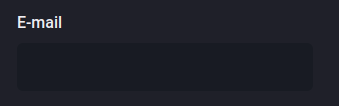

# COMPONENTE INPUT DO PROJETO DASHGO

Componente Input <br>
Projeto Dashgo <br>
Ignite 2021 <br>



src/components/Form/Input.tsx

```tsx
import { forwardRef, ForwardRefRenderFunction } from "react";
import { FieldError } from "react-hook-form";
import {
  FormLabel,
  FormControl,
  FormErrorMessage,
  Input as ChakraInput,
  InputProps as ChakraInputProps,
} from "@chakra-ui/react";

interface InputProps extends ChakraInputProps {
  name: string;
  label?: string;
  error?: FieldError;
}

const InputBase: ForwardRefRenderFunction<HTMLInputElement, InputProps> = (
  { name, label, error = null, ...rest },
  ref
) => {
  return (
    <FormControl isInvalid={!!error}>
      {!!label && <FormLabel htmlFor={name}>{label}</FormLabel>}

      <ChakraInput
        name={name}
        id={name}
        type="email"
        focusBorderColor="pink.500"
        bgColor="gray.900"
        variant="filled"
        _hover={{
          bgColor: "gray.900",
        }}
        size="lg"
        ref={ref}
        {...rest}
      />

      {!!error && <FormErrorMessage>{error.message}</FormErrorMessage>}
    </FormControl>
  );
};

export const Input = forwardRef(InputBase);
```
