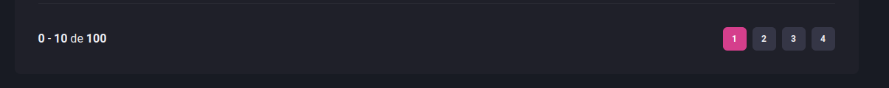

# COMPONENTE PAGINAÇÃO

Componente Págination <br>
Projeto Dashgo <br>
Ignite 2021 <br>



### Pagination Index

src/components/Pagination/index.tsx

```tsx
import { Box, Stack, Button } from "@chakra-ui/react";

import { PaginationItem } from "./PaginationItem";

export function Pagination() {
  return (
    <Stack
      direction={["column", "row"]}
      spacing="6"
      mt="8"
      justify="space-between"
      align="center"
    >
      <Box>
        <strong>0</strong> - <strong>10</strong> de <strong>100</strong>
      </Box>

      <Stack direction="row" spacing="2">
        <PaginationItem number={1} isCurrent />
        <PaginationItem number={2} />
        <PaginationItem number={3} />
        <PaginationItem number={4} />
      </Stack>
    </Stack>
  );
}
```

### Pagination Item

src/components/Pagination/PaginationItem.tsx

```tsx
import { Button } from "@chakra-ui/react";

interface PaginationItemProps {
  number: number;
  isCurrent?: boolean;
}

export function PaginationItem({
  isCurrent = false,
  number,
}: PaginationItemProps) {
  if (isCurrent) {
    return (
      <Button
        size="sm"
        fontSize="xs"
        width="4"
        colorScheme="pink"
        disabled
        _disabled={{
          bg: "pink.500",
          cursor: "default",
        }}
      >
        {number}
      </Button>
    );
  }

  return (
    <Button
      size="sm"
      fontSize="xs"
      width="4"
      bg="gray.700"
      _hover={{
        bg: "gray.500",
      }}
    >
      {number}
    </Button>
  );
}
```
