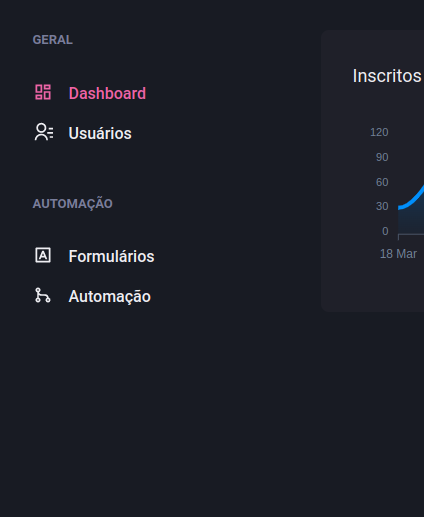

# COMPONENTE SIDEBAR DASHGO

Componente SideBar <br>
Projeto Dashgo <br>
Ingite 2021



### Sidebar

src/components/Sidebar/index.ts

```tsx
import {
  Box,
  useBreakpointValue,
  Drawer,
  DrawerOverlay,
  DrawerContent,
  DrawerCloseButton,
  DrawerHeader,
  DrawerBody,
} from "@chakra-ui/react";

import { useSidebarDrawer } from "../../contexts/SidebarDrawerContext";
import { SidebarNav } from "./SidebarNav";

export function Sidebar() {
  const { isOpen, onClose } = useSidebarDrawer();

  const isDrawerSidebar = useBreakpointValue({
    base: true,
    lg: false,
  });

  if (isDrawerSidebar) {
    return (
      <Drawer isOpen={isOpen} placement="left" onClose={onClose}>
        <DrawerOverlay>
          <DrawerContent bg="gray.800" p="4">
            <DrawerCloseButton mt="6" />
            <DrawerHeader>Navegação</DrawerHeader>

            <DrawerBody>
              <SidebarNav />
            </DrawerBody>
          </DrawerContent>
        </DrawerOverlay>
      </Drawer>
    );
  }

  return (
    <Box as="aside" w="64" mr="8">
      <SidebarNav />
    </Box>
  );
}
```

### SidebarNav

src/components/Sidebar/SidebarNav.tsx

```tsx
import { Stack } from "@chakra-ui/react";
import {
  RiContactsLine,
  RiDashboardLine,
  RiGitMergeLine,
  RiInputMethodLine,
} from "react-icons/ri";

import { NavSection } from "./NavSection";
import { NavLink } from "./NavLink";

export function SidebarNav() {
  return (
    <Stack spacing="12" align="flex-start">
      <NavSection title={"GERAL"}>
        <NavLink icon={RiDashboardLine} href="/dashboard">
          Dashboard
        </NavLink>
        <NavLink icon={RiContactsLine} href="/users">
          Usuários
        </NavLink>
      </NavSection>
      <NavSection title="AUTOMAÇÃO">
        <NavLink icon={RiInputMethodLine} href="/forms">
          Formulários
        </NavLink>
        <NavLink icon={RiGitMergeLine} href="/automation">
          Automação
        </NavLink>
      </NavSection>
    </Stack>
  );
}
```

### NavSection

src/components/Sidebar/NavSection.tsx

```tsx
import { ReactNode } from "react";
import { Box, Text, Stack, Link, Icon } from "@chakra-ui/react";

interface NavSectionProps {
  title: string;
  children: ReactNode;
}

export function NavSection({ title, children }: NavSectionProps) {
  return (
    <Box>
      <Text fontWeight="bold" color="gray.400" fontSize="small">
        {title}
      </Text>
      <Stack spacing="4" mt="8" align="stretch">
        {children}
      </Stack>
    </Box>
  );
}
```

### NavLink

src/components/Sidebar/NavLink.tsx

```tsx
import { ElementType } from "react";
import {
  Text,
  Link as ChakraLink,
  Icon,
  LinkProps as ChakraLinkProps,
} from "@chakra-ui/react";

import { ActiveLink } from "../ActiveLink";

interface NavLinkProps extends ChakraLinkProps {
  icon: ElementType;
  children: string;
  href: string;
}

export function NavLink({ icon, children, href, ...rest }: NavLinkProps) {
  return (
    <ActiveLink href={href} passHref>
      <ChakraLink display="flex" align="center" {...rest}>
        <Icon as={icon} fontSize="20" />
        <Text ml="4" fontWeight="medium">
          {children}
        </Text>
      </ChakraLink>
    </ActiveLink>
  );
}
```

### ActiveLink

src/components/ActiveLink.tsx

```tsx
import Link, { LinkProps } from "next/link";
import { useRouter } from "next/router";
import { cloneElement, ReactElement } from "react";

interface ActiveLinkProps extends LinkProps {
  children: ReactElement;
  shouldMatchExactHref?: boolean;
}

export function ActiveLink({
  children,
  shouldMatchExactHref = false,
  ...rest
}: ActiveLinkProps) {
  const { asPath } = useRouter();

  let isActive = false;

  if (shouldMatchExactHref && (asPath === rest.href || rest.as)) {
    isActive = true;
  }

  if (
    !shouldMatchExactHref &&
    (asPath.startsWith(String(rest.href)) || asPath.startsWith(String(rest.as)))
  ) {
    isActive = true;
  }

  return (
    <Link {...rest}>
      {cloneElement(children, {
        color: isActive ? "pink.400" : "gray.50",
      })}
    </Link>
  );
}
```
