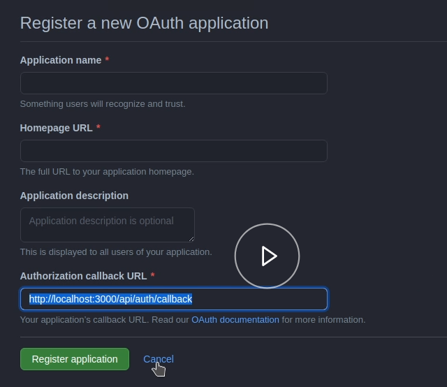
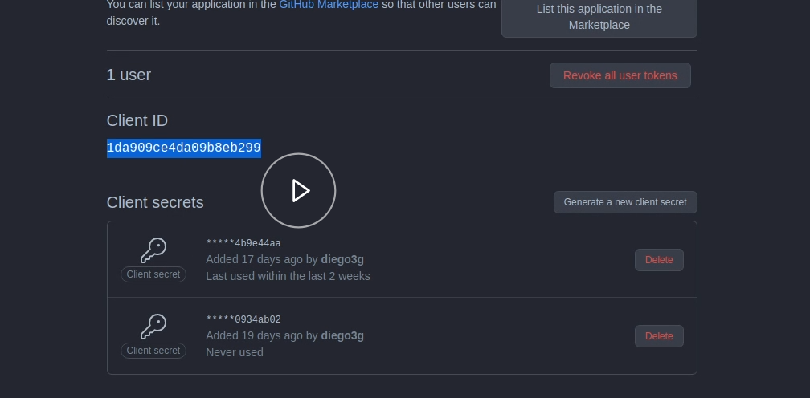

# AUTENTICAÇÃO COM AUTH0 E GITHUB

## Instalando a biblioteca do next auht

```cmd
npm install next-auth
npm install @types/next-auth -D
```

Criar a rota de autenticação

pages/api/auth/[...nextauth].ts

```ts
import NextAuth from "next-auth";
import Providers from "next-auth";

export default NextAuth({
  providers: [
    Providers.GitHub({
      clientId: process.env.GITHUB_CLIENT_ID,
      clientSecret: process.env.GITHUB_CLIENT_SECRET,
      scope: "read:user",
    }),
  ],
});
```

## Configurando o login de acesso ao projeto no GitHub

No painel do github entrar em:
Settings > Development Settings > Oauth Apps > NewsOauthApp

Preencher os campos solicitados:

- application name: exemplo_teste(dev)
- homepage URL: http://localhost:3000
- description: aplicação para teste de autenticação.
- Authorization callback URL: http://localhost:3000/api/auth/callback

Clicar no botão para registrar a aplicação.



Copiar os dados id e o secret do cliente.
Se necessário gere um novo secret, lembrando que o secret é mostrado apenas no memento em que ele é criado.



## Configurando os dados do cliente

Criar um arquivo env.local na raiz do projeto e adicionar os dados de acesso ao github do cliente.

env.local

```
# GITHUB
GITHUB_CLIENT_ID=d2ec3e24a8fcd816d217
GITHUB_CLIENT_SECRET=jfdafjfjfjdfkdcfkldjfkldsnfofjpfnewfjklfnlfndslf
```

## Configurando o botão de signIn

Adicionar a função signIn e useSession do next-auth no componente SignInButton.

components/signInButton/index.tsx

```jsx
import { signIn, signOut, useSession } from "next-auth/client";

export function SignInButton() {
  const [session] = useSession();

  return session ? (
    <button onClick={() => signOut()}>{session.user.name}</button>
  ) : (
    <button onClick={() => signIn()}>Sign in with Github</button>
  );
}
```

## Adicionando o provider na aplicação

Adicionar o provider do contexto de autenticação no arquivo pages/\_App.ts

pages/\_App.ts

```jsx
import { AppProps } from "next/app";
import { Provider as nextAuthProvider } from "next-auth/client";

function MyApp({ Component, pageProps }: AppProps) {
  return (
    <NextAuthProvider session={pateProps.session}>
      <Component {...pageProps} />
    </NextAuthProvider>
  );
}

export default MyApp;
```
