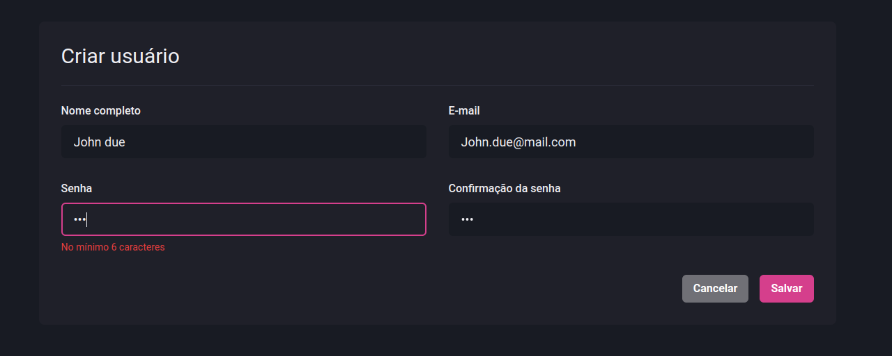

# FORMULÁRIO DE CADASTRO DE USUÁRIO COM CHAKRA-UI E REACT-HOOK-FORM

Formulário de cadastro de usuários
Projeto Dashgo
Ignite 2021



## Página de cadastro de usuários

- framework NextJS
- componentes Chakra-ui
- validação com biblioteca yup
- Formulário React-Hook-Form

src/pages/users/create.tsx

```tsx
import Link from "next/link";
import { useForm, SubmitHandler } from "react-hook-form";
import * as yup from "yup";
import { yupResolver } from "@hookform/resolvers/yup";
import {
  Box,
  Flex,
  VStack,
  HStack,
  Heading,
  Button,
  Divider,
  SimpleGrid,
} from "@chakra-ui/react";

import { Header } from "../../components/Header";
import { Sidebar } from "../../components/Sidebar";
import { Input } from "../../components/Form/Input";

type CreateUserFormData = {
  name: string;
  email: string;
  password: string;
  password_confimation: string;
};

const CreateUserFormSchema = yup.object({
  name: yup.string().required("Nome obrigatório"),
  email: yup.string().required("E-mail obrigatório").email("E-mail invalído"),
  password: yup
    .string()
    .required("Senha obrigatória")
    .min(6, "No mínimo 6 caracteres"),
  password_confirmation: yup
    .string()
    .oneOf([null, yup.ref("password")], "As senhas precisam ser iguais"),
});

export default function CreateUser() {
  const { register, handleSubmit, formState } = useForm({
    resolver: yupResolver(CreateUserFormSchema),
  });
  const { errors } = formState;

  const handleCreateUser: SubmitHandler<CreateUserFormData> = async (
    values
  ) => {
    await new Promise((resolve) => setTimeout(resolve, 2000));

    console.log(values);
  };

  return (
    <Box>
      <Header />

      <Flex w="100%" my="6" maxWidth={1480} mx="auto" px="6">
        <Sidebar />

        <Box
          as="form"
          flex="1"
          borderRadius={8}
          bg="gray.800"
          p={["6", "8"]}
          onSubmit={handleSubmit(handleCreateUser)}
        >
          <Heading size="lg" fontWeight="normal">
            Criar usuário
          </Heading>

          <Divider my="6" borderColor="gray.700" />

          <VStack spacing="8">
            <SimpleGrid minChildWidth="240px" spacing={["6", "8"]} w="100%">
              <Input
                name="name"
                type="text"
                label="Nome completo"
                error={errors.name}
                {...register("name")}
              />
              <Input
                name="email"
                type="email"
                label="E-mail"
                error={errors.email}
                {...register("email")}
              />
            </SimpleGrid>

            <SimpleGrid minChildWidth="240px" spacing={["6", "8"]} w="100%">
              <Input
                name="password"
                type="password"
                label="Senha"
                error={errors.password}
                {...register("password")}
              />
              <Input
                name="password_confirmation"
                type="password"
                label="Confirmação da senha"
                error={errors.password_confirmation}
                {...register("password_confirmation")}
              />
            </SimpleGrid>
          </VStack>

          <Flex mt="8" justify="flex-end">
            <HStack spacing="4">
              <Link href="/users" passHref>
                <Button as="a" colorScheme="whiteAlpha">
                  Cancelar
                </Button>
              </Link>
              <Button
                type="submit"
                colorScheme="pink"
                isLoading={formState.isSubmitting}
              >
                Salvar
              </Button>
            </HStack>
          </Flex>
        </Box>
      </Flex>
    </Box>
  );
}
```

## Component Input

src/components/Form/Input.tsx

```tsx
import { forwardRef, ForwardRefRenderFunction } from "react";
import { FieldError } from "react-hook-form";
import {
  FormLabel,
  FormControl,
  FormErrorMessage,
  Input as ChakraInput,
  InputProps as ChakraInputProps,
} from "@chakra-ui/react";

interface InputProps extends ChakraInputProps {
  name: string;
  label?: string;
  error?: FieldError;
}

const InputBase: ForwardRefRenderFunction<HTMLInputElement, InputProps> = (
  { name, label, error = null, ...rest },
  ref
) => {
  return (
    <FormControl isInvalid={!!error}>
      {!!label && <FormLabel htmlFor={name}>{label}</FormLabel>}

      <ChakraInput
        name={name}
        id={name}
        type="email"
        focusBorderColor="pink.500"
        bgColor="gray.900"
        variant="filled"
        _hover={{
          bgColor: "gray.900",
        }}
        size="lg"
        ref={ref}
        {...rest}
      />

      {!!error && <FormErrorMessage>{error.message}</FormErrorMessage>}
    </FormControl>
  );
};

export const Input = forwardRef(InputBase);
```
