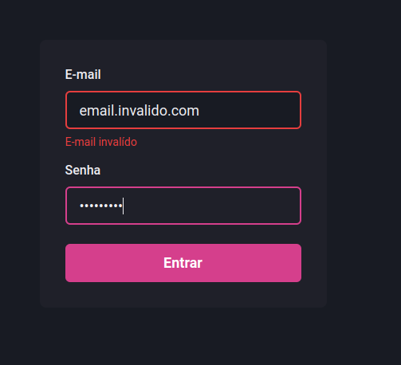

# FORMULÁRIO COM REACT-HOOK-FORMS NO NEXTJS

Componente Formulário
Projeto Dashgo
Ignite 2021



### Página do formulário

Exemplo de formulário de SignIn no Nextjs:

- components do chakra-ui
- biblioteca react-hook-form
- validação com a biblioteca yup

src/pages/index.tsx

```tsx
import { Flex, Button, Stack } from "@chakra-ui/react";
import { useForm, SubmitHandler } from "react-hook-form";
import * as yup from "yup";
import { yupResolver } from "@hookform/resolvers/yup";

import { Input } from "../components/Form/Input";

type SignInFormData = {
  email: string;
  passwrod: string;
};

const signInFormSchema = yup.object({
  email: yup.string().required("E-mail obrigatório").email("E-mail invalído"),
  password: yup.string().required("Senha obrigatória"),
});

export default function SignIn() {
  const { register, handleSubmit, formState } = useForm({
    resolver: yupResolver(signInFormSchema),
  });
  const { errors } = formState;

  const handleSignIn: SubmitHandler<SignInFormData> = async (values) => {
    await new Promise((resolve) => setTimeout(resolve, 2000));

    console.log(values);
  };

  return (
    <Flex w="100vw" h="100vh" align="center" justify="center">
      <Flex
        as="form"
        w="100%"
        maxW={360}
        bg="gray.800"
        p="8"
        borderRadius={8}
        flexDir="column"
        onSubmit={handleSubmit(handleSignIn)}
      >
        <Stack spacing="4">
          <Input
            name="email"
            type="email"
            label="E-mail"
            error={errors.email}
            {...register("email")}
          />
          <Input
            name="password"
            type="password"
            label="Senha"
            error={errors.password}
            {...register("password")}
          />
        </Stack>

        <Button
          type="submit"
          mt="6"
          colorScheme="pink"
          size="lg"
          isLoading={formState.isSubmitting}
        >
          Entrar
        </Button>
      </Flex>
    </Flex>
  );
}
```

### Componente Input

É um componente input do ChakraUi com as seguintes caracteristicas:

- Utiliza componente Input do chakra-ui
- utiliza a biblioteca do react-hook-forms
- Componente não controlado (utiliza a ref para acessar o componente)
- Permite uso de Label
- Permite mostar mensagem de erro

src/components/Form/Input.tsx

```tsx
import { forwardRef, ForwardRefRenderFunction } from "react";
import { FieldError } from "react-hook-form";
import {
  FormLabel,
  FormControl,
  FormErrorMessage,
  Input as ChakraInput,
  InputProps as ChakraInputProps,
} from "@chakra-ui/react";

interface InputProps extends ChakraInputProps {
  name: string;
  label?: string;
  error?: FieldError;
}

const InputBase: ForwardRefRenderFunction<HTMLInputElement, InputProps> = (
  { name, label, error = null, ...rest },
  ref
) => {
  return (
    <FormControl isInvalid={!!error}>
      {!!label && <FormLabel htmlFor={name}>{label}</FormLabel>}

      <ChakraInput
        name={name}
        id={name}
        type="email"
        focusBorderColor="pink.500"
        bgColor="gray.900"
        variant="filled"
        _hover={{
          bgColor: "gray.900",
        }}
        size="lg"
        ref={ref}
        {...rest}
      />

      {!!error && <FormErrorMessage>{error.message}</FormErrorMessage>}
    </FormControl>
  );
};

export const Input = forwardRef(InputBase);
```
