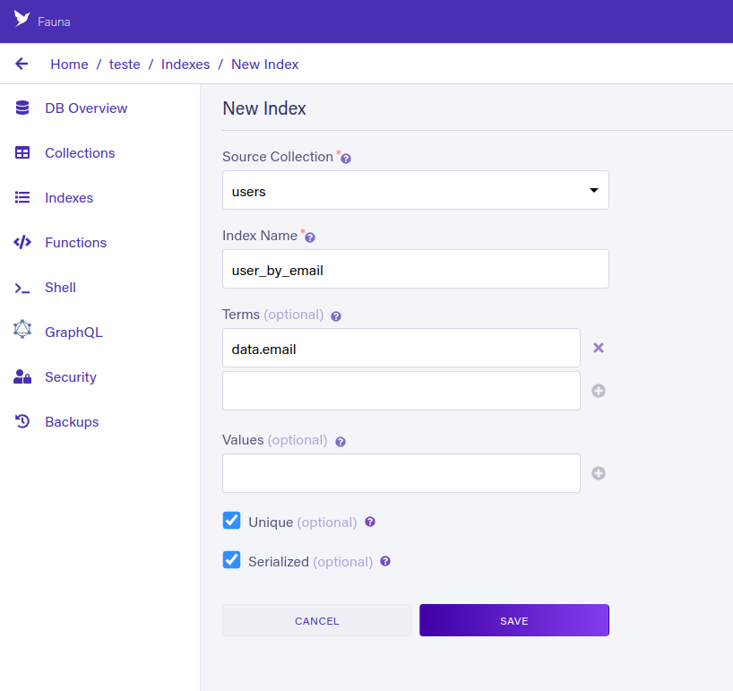

# UTILIZANDO FAUNA DB COM O NEXTJS

## FaunaDB

[Site do FAUNADB](https://fauna.com/)

[DOCUMENTAÇÃO](https://docs.fauna.com/fauna/current)

É um banco de dados recomendado para aplicações serverless.

É um banco de dados que trabalha através de requisições http, sem necessidade de ter uma coneção ativa com o banco de dados.

O faunaDB pode ser usado no site do fauna.com ou localmente através de uma imagem docker.

## Configurando a plataforma do FaunaDB

### Criando uma nova database

- Dentro do painel do fauna, clicar em Create Database.
- Selecione um nome para o projeto.
- Selecione uma região.
- Clique em criar.


### Criando as credenciais de acesso

- Selecione Security no menu lateral.
- clique em New Keys.
- Defina as regras de acesso para a chave de acesso conforme suas necessidades.
- Dê um nome para a chave de acesso, e clique em criar.


- Copiar a chave de acesso para adiciona-la no projeto.


### Criando uma Collections

- Clique em Collections no menu lateral do painel do fauna.
- Clique em New Collections.
- Adicione o nome da Collection.
- Clique em salvar.


### Criando um Índice (Index)

- Clique em Index no menu lateral do painel do fauna.
- Clique em New Index.
- Selecione a Collection.
- Dê um nome para o índice.
- Adicione os termos.
- Selecione a opção unique (opcional).
- Clique em salvar.



## Configurando o faunadb na aplicação nextjs

### Adicionar a chave de acesso a database no arquivo env.local

env.local

```
# FAUNA

FAUNADB_KEY=fnAE2-NkTrACUY_cKDOoO3nPvY3d_ZmYizl0w5sw

```

obs.: o acesso as keys só poder ser feitas pelo lado do servidor Next, ou seja pela funções das apiRoutes, ou pelos métodos getStaticProps e getServerProps.

### Instalar a biblioteca (SDK) do faunadb

```cmd
npm install faunadb
```

### Criar o arquivo de configuração do faunadb

src/services/fauna.ts

```js
import { Client } from "faunadb";

export const fauna = new Client({
  secret: process.env.FAUNADB_KEY,
  domain: "db.us.fauna.com",
});
```

### Salvando um dado no banco

src/pages/api/auth/[...nextauth].ts

```ts
import NextAuth from "next-auth";
import Providers from "next-auth/providers";
import { query as q } from "faunadb";

import { fauna } from "../../../services/fauna";

export default NextAuth({
  providers: [
    Providers.GitHub({
      clientId: process.env.GITHUB_CLIENT_ID,
      clientSecret: process.env.GITHUB_CLIENT_SECRET,
      scope: "read:user",
    }),
  ],
  calbacks: {
    async signIn(user, account, profile) {
      const { email } = user;

      try {
        await fauna.query(q.Create(q.collection("users"), { data: { email } }));
        return true;
      } catch {
        return false;
      }
    },
  },
});
```
