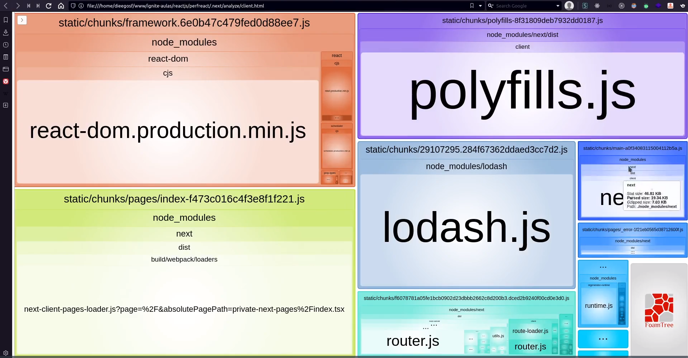

# BUNDLE ANALISER

Auxilia na visualização do tamanho do bundle da aplicação

## instalação da biblioteca bundle-analyzer

```cmd
npm install @next/bundle-analyzer

```

## Configurando o bundle analyzer na aplicação

Criar um arquivo chamado next.config.js

next.config.js

```js
const withBundleAnalyzer = require("@next/bundle-analyzer")({
  enabled: proccess.env.ANALYZE === "true",
});

module.exports = withBundleAnalyzer({});
```

## Criar o build da aplicação com o bundle analyzer

```cmd
ANALYZE=true npm build
```


